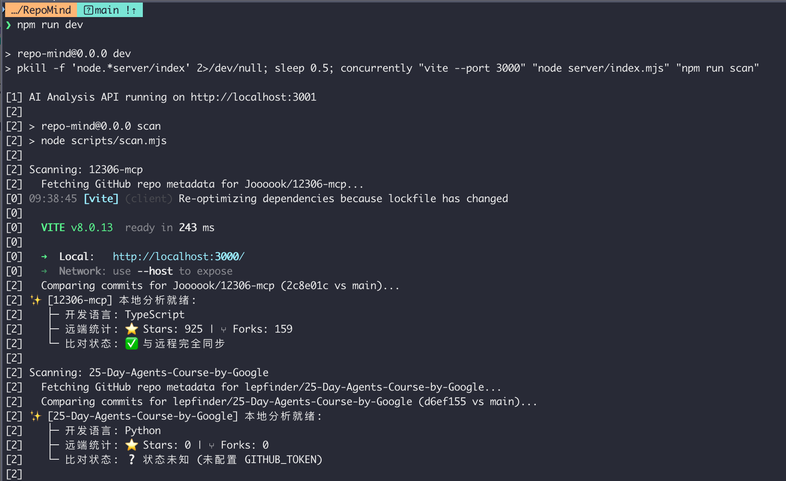
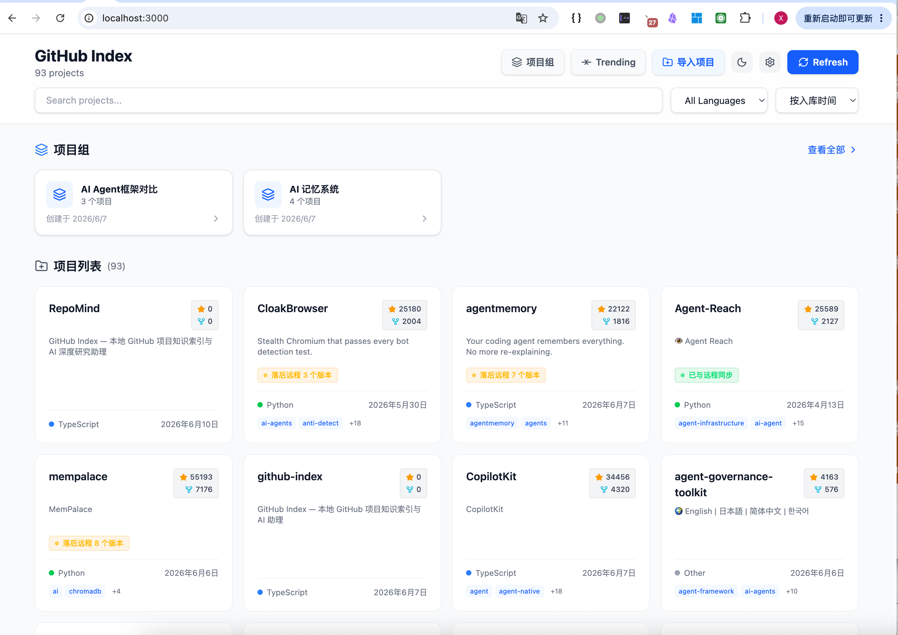

# RepoMind — 本地 GitHub 项目深度研究助理

RepoMind 是一款专为开发者打造的**本地 Git 仓库深度研究助理**。它自动扫描本地的所有 Git 仓库，智能解析项目元数据并持久化到 SQLite。内置**双 AI 引擎**（Hermes + Claude Code），支持对任意项目进行深度分析和交互式提问，还能将多个同类项目打包为「项目组」进行跨项目批量对比分析。

> 完全运行于**本地**，绝不上传任何代码和文件，保证绝对的数据隐私和安全。

---

## 核心特性

- **自动扫描与元数据索引**：递归扫描本地 Git 仓库，智能检测语言、提交记录，同步 GitHub 远端 Stars/Forks/Topics
- **本地与远程版本比对**：自动检测版本领先/落后状态，支持一键 `git pull` 同步
- **GitHub 仓库一键导入**：输入链接自动克隆、扫描、入库，全程 SSE 流式进度
- **双 AI 引擎深度分析**：Hermes（本地大模型）与 Claude Code（CLI 工具调用）可热切换，支持多轮追问、工具操作实时展示
- **项目组对比分析**：多个同类项目打包分析，自动生成对比表格和方案推荐
- **内置代码浏览器**：三栏布局（文件树 + 代码预览 + AI 分析），支持语法高亮和图片预览
- **Chrome 浏览器扩展**：GitHub 页面一键导入或直达本地详情
- **亮色/暗色主题**：一键切换，自动记忆偏好

---

## 快速上手

### 1. 前置准备

- **Node.js** 环境（建议 v18+）
- **AI 引擎**（至少配置其一）：
  - **Hermes**：本地运行 Hermes API Gateway（默认 `http://127.0.0.1:8642`），API Key 配置在 `~/.hermes/.env` 的 `API_SERVER_KEY` 字段
  - **Claude Code**：安装 Claude Code CLI（`claude` 命令可用即可）
- （可选）设置 `GITHUB_TOKEN` 环境变量以启用 GitHub API 同步
- （可选）安装 Chrome 扩展以获得 GitHub 页面一键导入体验

### 2. 配置环境变量

复制 `.env.example` 为 `.env` 并根据需要修改：

```bash
cp .env.example .env
```

- **`REPO_MIND_DIR`**（可选）：本地 GitHub 项目存放目录，默认 `~/workspace/github`
- **`GITHUB_TOKEN`**（可选但强烈建议）：GitHub Personal Access Token，用于同步元数据和版本比对，提升 API 限额（60 → 5000 次/小时）

也可通过系统环境变量覆盖：

```bash
export REPO_MIND_DIR="/your/custom/path"
export GITHUB_TOKEN="your_token_here"
```

### 3. 安装并启动

```bash
npm install
npm run dev
```

前端运行于 `http://localhost:3000`，后端 API 运行于 `http://localhost:3001`。

## 运行截图

<p align="center">
  
  <br /><em>启动扫描 — 自动遍历本地 Git 仓库并同步元数据</em>
</p>

<p align="center">
  
  <br /><em>项目首页 — 卡片网格展示、搜索筛选、项目组入口</em>
</p>

---

## 使用方式

| 场景 | 操作 |
| :--- | :--- |
| **浏览项目** | 首页卡片网格展示所有项目，支持搜索、语言筛选、排序 |
| **AI 深度分析** | 点击项目卡片进入详情，在 AI 面板输入问题或点击「初始分析」 |
| **切换 AI 引擎** | 右上角设置图标 → 选择 Hermes 或 Claude Code |
| **导入 GitHub 项目** | 网页端点击「导入项目」输入链接，或通过 Chrome 扩展在 GitHub 页面一键导入 |
| **项目组对比** | 点击「项目组」创建组 → 添加项目 → 发起对比分析 |
| **同步代码** | 项目详情页点击同步按钮，或点击 Refresh 触发全量扫描 |

### Chrome 浏览器扩展

扩展会在 GitHub 仓库页面自动注入操作按钮，实现浏览器与本地工具链的无缝衔接。

**安装方式：**

1. 打开 Chrome，进入 `chrome://extensions/`
2. 开启右上角「开发者模式」
3. 点击「加载已解压的扩展程序」，选择本项目的 `chrome-extension/` 目录
4. 确保 RepoMind 后端已启动（`npm run dev`）

**功能说明：**

| 场景 | 按钮 | 行为 |
| :--- | :--- | :--- |
| 浏览**未导入**的仓库 | 「导入到 RepoMind」 | 一键克隆到本地并建立索引，按钮实时展示解析→克隆→扫描→同步进度 |
| 浏览**已导入**的仓库 | 「在 RepoMind 查看」 | 新标签页直达本地项目详情页（文件树 + 代码预览 + AI 分析） |

> 扩展仅在 `https://github.com/*/*` 仓库页面生效，需要 RepoMind 后端服务运行在 `http://localhost:3001`。

---

## 详细文档

- [技术栈与项目结构](docs/tech-stack.md) — 技术选型、目录结构说明
- [API 接口与开发指南](docs/api-reference.md) — API 参考、命令说明、AI 分析原理、安全设计、自定义扩展
- [Chrome 浏览器扩展](docs/chrome-extension.md) — 安装方式、功能说明、技术实现细节
